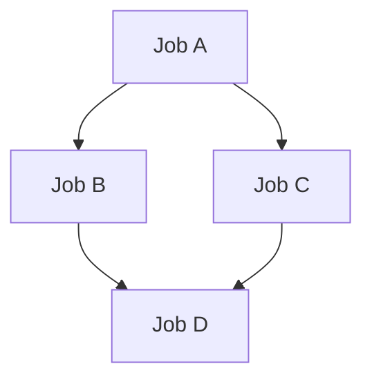
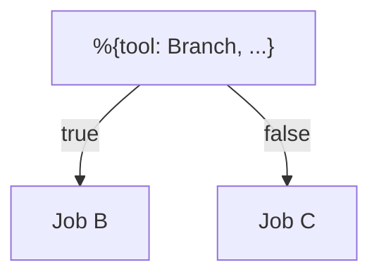
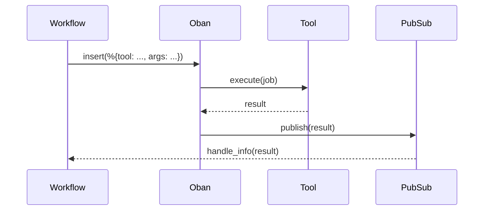
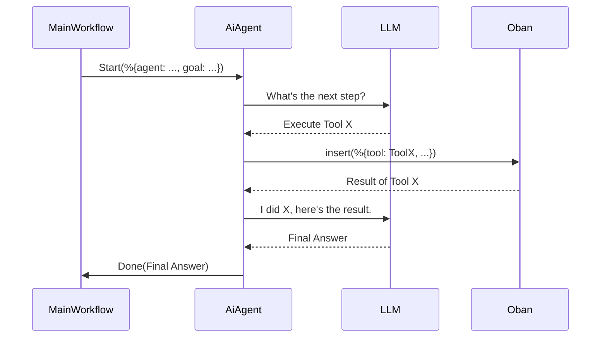

# Urza - Hackathon Project

Welcome to Urza, a powerful, scalable workflow engine built with Elixir and powered by [Oban](https://getoban.pro/). Urza is designed to define and execute complex, multi-step workflows that can include concurrent job execution, conditional branching, human-in-the-loop checkpoints, and even AI-powered agents.

Demo Links:
Overview:  
Simple DAG: 
Human in the loop: 
Branching:
Agent: 

## Core Concept

Urza treats workflows as code. A workflow is a simple Elixir map that defines a series of jobs, their dependencies, and how data flows between them. This approach makes workflows easy to create and manage.

```elixir
%{ 
 id: "main-workflow",
 work: [
   # ... list of jobs ...
 ]
}
```

---

## Features

### Queueing tools
Each "tool" used by Agents and DAGs is an Oban Job,
this allows us to have 
* Custom retries for different tools
* Dedicated queues per resource
* Automated retries, tracking and pausing 
* rate limiting
* Pausing/Killing/retrying jobs via dashboard/programmatically

example

```elixir
  %{
    tool: Urza.Tools.Echo,
    args: %{"content" => {:const, "Hello world"}},
    deps: [],
    ref: []
  }
```

### Concurrent Execution (Fan-out/Fan-in)

Urza can run multiple jobs concurrently (fan-out) and then aggregate their results for a subsequent job (fan-in). This is achieved by defining dependencies between jobs.



```elixir
%{
  tool: A,
  args: %{},
  ref: "$A",
  deps: []
},%{
  tool: B,
  args: %{},
  ref: "$B",
  deps: ["$A"]
},%{
  tool: C,
  args: %{},
  ref: "$C",
  deps: ["$A"]
},%{
  tool: D,
  args: %{},
  ref: "$D",
  deps: ["$B","$C"]
}
```

### Dynamic job addition
Since we are using a queue based mechanism we can dynamically create and add jobs for execution
```elixir
 iex> Urza.Workflow.add_job(workflow_id,%{tool: Urza.Tools.Echo,args: % .....})
```

### Dynamic Value Passing

The output of any job can be dynamically passed as input to any subsequent job. This allows for complex data pipelines where the output of one step is the input of the next.

```elixir
%{
  tool: Calculator,
  args: %{"l" => {:dyn, "$1"}, "r" => {:dyn, "$2"}},
  ref: "$3",
  deps: ["$1", "$2"]
}
```

### Conditional Branching

Workflows can include conditional logic. The `Branch` tool allows a workflow to take different paths based on a given condition, enabling dynamic and flexible execution flows.


```elixir
%{
  tool: Branch,
  args: %{
    "condition" => {:const, criteria},
    "true" => {:const, "$1"},
    "false" => {:const, "$2"}
  },
  ref: nil,
  deps: []
        },
```

### Human in the Loop

For tasks that require human intervention or approval, Urza provides a `HumanCheckpoint` tool. This tool pauses the workflow and waits for an external signal before proceeding, making it ideal for approval steps or manual data entry.

### AI Agent Integration

Urza can delegate complex, goal-oriented tasks to AI agents. An AI agent is given a set of tools and a goal, and it will autonomously create and execute a sequence of jobs to achieve that goal. The main workflow can start an agent and wait for its final result.The LLm uses same tools as user so we have visibility through Oban web for the same

```elixir
  %{
    id: "agent",
    work: [
      %{
        agent: "007",
        tools: ["calculator", "echo","wait"],
        goal: "add 33,27 and then divide by then, then print it",
        ref: "$agent_007",
        deps: []
      },
      %{
        tool: Echo,
        args: %{"content" => {:dyn, "$agent_007"}},
        ref: nil,
        deps: ["$agent_007"]
      }
    ]
  }
```

### Resilience (Retries & Backoff)

Built on top of Oban, Urza inherits its powerful reliability features. Jobs can be configured with automatic retries, exponential backoff, and a maximum number of attempts, ensuring that transient failures don't derail an entire workflow.

---

## Architecture

### Core Workflow

Urza's core is a `Workflow` GenServer that manages the state of a workflow. When a job is ready to run, it's inserted into Oban.



### AI Agent Interaction

AI Agents run in their own supervised processes, managing their own internal state and tool execution loop. They report back to the main workflow only when their goal is achieved.



---

## Scalability

### Vertical Scaling

Urza runs on the Elixir BEAM VM, which is designed for concurrency. It will naturally take advantage of all available CPU cores on a single machine to run jobs in parallel, without any code changes.

### Horizontal Scaling

Urza is designed to scale horizontally. By running multiple Elixir nodes, you can create a distributed cluster of workers. Oban's distributed architecture ensures that jobs are processed by any available node, providing massive horizontal scalability for your workflows.
reference: https://hexdocs.pm/oban/clustering.html
node specific job queues: https://hexdocs.pm/oban/splitting-queues.html
---

## Getting Started

Requires elixir (1.18) installed

To start your Phoenix server:

* Run `mix setup` to install and setup dependencies
* Start  with `iex -S mix phx.server`

Now you can visit [`localhost:4000`](http://localhost:4000/oban) to view jobs 

*  N8N style DAG

```
iex -S mix phx.server
iex> w = Urza.Workflow.test_chaining()
iex> Urza.WorkflowSupervisor(w.id,w.work)
```


* run fan_in fan_out demo 

```
iex -S mix phx.server
iex> w = Urza.Workflow.test_fan()
iex> Urza.WorkflowSupervisor(w.id,w.work)
```

* run  agent demo

```
iex -S mix phx.server
iex> w = Urza.Workflow.test_agent()
iex> Urza.WorkflowSupervisor(w.id,w.work)
```

* run   human in the loop demo

```
iex -S mix phx.server
iex> Phoenix.PubSub.subscribe(Urza.PubSub,"notification")
iex> w = Urza.Workflow.test_human_checkpoint()
iex> Urza.WorkflowSupervisor(w.id,w.work)
iex> flush
# will print out notification message with `job id`
iex> Urza.Tools.HumanCheckPoint.approve(`job id`)
```

* run branching 
```
iex -S mix phx.server
iex> w = Urza.Workflow.test_branch("1",true)
iex> w2 = Urza.Workflow.test_branch("2",false)
iex> Urza.WorkflowSupervisor(w.id,w.work)
iex> Urza.WorkflowSupervisor(w2.id,w2.work)
```


