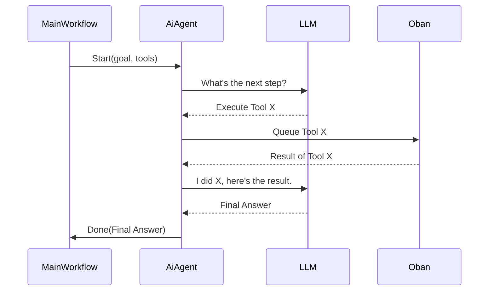

# Urza - Hackathon Project

Welcome to Urza, a powerful, scalable workflow engine built with Elixir and powered by [Oban](https://getoban.pro/). Urza is designed to define and execute complex, multi-step workflows that can include concurrent job execution, conditional branching, human-in-the-loop checkpoints, and even AI-powered agents.

## Core Concept

Urza treats workflows as code. A workflow is a simple Elixir map that defines a series of jobs, their dependencies, and how data flows between them. This approach makes workflows easy to create.

At its heart, Urza leverages the power of Elixir's BEAM VM for massive concurrency and Oban for reliable, distributed background job processing.

```elixir
%{ 
 id: "main-workflow",
 work: [
   # ... list of jobs ...
 ]
}
```

---

## Features

### Workflow as Code

Workflows are defined in simple Elixir maps, making them easy to read, write,with potential for JSON interop.

### Concurrent Execution (Fan-out/Fan-in)

Urza can run multiple jobs concurrently (fan-out) and then aggregate their results for a subsequent job (fan-in). This is achieved by defining dependencies between jobs.

**Diagram: Fan-out / Fan-in**
```
          /--> Job B --\ 
Job A ---               ---> Job D
          \--> Job C --/
```

```elixir
    %{
        tool: A,
        args: %{},
        ref: "$A"
        deps: []
    },
    %{
        tool: B,
        args: %{},
        ref: "$B"
        deps: ["$A"]
    },
    %{
        tool: C,
        args: %{},
        ref: "$C"
        deps: ["$A"]
    },
    %{
        tool: D,
        args: %{},
        ref: "$D"
        deps: ["$B","$C"]
    }
```

### Dynamic Value Passing

The output of any job can be dynamically passed as input to any subsequent job. This allows for complex data pipelines where the output of one step is the input of the next.

```elixir
%{
  tool: Calculator,
  args: %{"l" => {:dyn, "$1"}, "r" => {:dyn, "$2"}},
  ref: "$3",
  deps: ["$1", "$2"]
}
```

### Conditional Branching

Workflows can include conditional logic. The `Branch` tool allows a workflow to take different paths based on a given condition, enabling dynamic and flexible execution flows.

**Diagram: Branching**
```
          /--> (true) --> Job B
Job A --- 
          \--> (false) --> Job C
```

### Human in the Loop

For tasks that require human intervention or approval, Urza provides a `HumanCheckpoint` tool. This tool pauses the workflow and waits for an external signal before proceeding, making it ideal for approval steps or manual data entry.

### AI Agent Integration

Urza can delegate complex, goal-oriented tasks to AI agents. An AI agent is given a set of tools and a goal, and it will autonomously create and execute a sequence of jobs to achieve that goal. The main workflow can start an agent and wait for its final result.

### Resilience (Retries & Backoff)

Built on top of Oban, Urza inherits its powerful reliability features. Jobs can be configured with priorities,dedicated resource queues,introspection, automatic retries, exponential backoff, and a maximum number of attempts, ensuring that transient failures don't derail an entire workflow.

---

## Architecture

### Core Workflow

Urza's core is a `Workflow` GenServer that manages the state of a workflow. When a job is ready to run, it's inserted into Oban.

**Diagram: Workflow --> Oban**
```
+------------+
| Workflow   | ---(queues ready jobs)--> +------+
| GenServer  |                           | Oban |
+------------+                           +------+
     ^                                      |
     |                                 (executes job)
     |                                      |
     |                                      |
     |                                      V
     |                                   +------+
     +---------------------------------- | Tool |
                                         +------+
```

### AI Agent Interaction

AI Agents run in their own supervised processes, managing their own internal state and tool execution loop. They report back to the main workflow only when their goal is achieved.



---

## Scalability

### Vertical Scaling

Urza runs on the Elixir BEAM VM, which is designed for concurrency. It will naturally take advantage of all available CPU cores on a single machine to run jobs in parallel, without any code changes.

### Horizontal Scaling

Urza is designed to scale horizontally. By running multiple Elixir nodes, you can create a distributed cluster of workers. Oban's distributed architecture ensures that jobs are processed by any available node, providing massive horizontal scalability for your workflows.

---

## Getting Started

To start your Phoenix server:

* Run `mix setup` to install and setup dependencies
* Start Phoenix endpoint with `mix phx.server` or inside IEx with `iex -S mix phx.server`

Now you can visit [`localhost:4000`](http://localhost:4000) from your browser.
